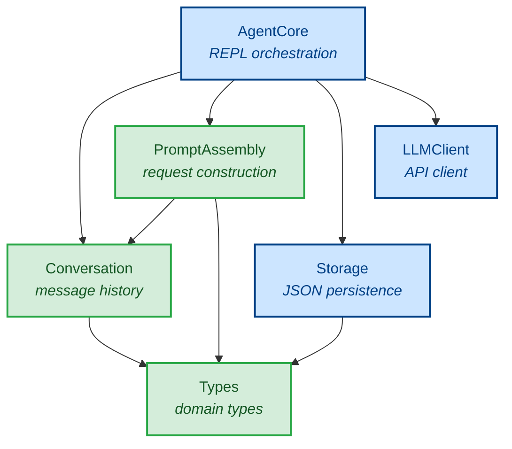

# Architecture Diagram

Module dependency graph for the Lumen agent, showing the relationship between pure and IO modules.

Green modules are **pure** (no IO) and are fully testable with property-based testing. Blue modules perform **IO** (filesystem, network, or terminal).

## Module Responsibilities

| Module | Layer | IO? | Responsibility |
|--------|-------|-----|----------------|
| **AgentCore** | Orchestration | Yes (terminal) | REPL loop, coordinates all other modules |
| **LLMClient** | IO Boundary | Yes (network) | HTTP requests to Anthropic API |
| **Storage** | IO Boundary | Yes (filesystem) | Read/write conversation JSON files |
| **PromptAssembly** | Pure Core | No | Build API requests from state |
| **Conversation** | Pure Core | No | Message list operations |
| **Types** | Pure Core | No | Shared data type definitions |

## Key Observations

- **AgentCore** is the only module that depends on everything else. No other module imports `AgentCore`.
- **Types** has no internal dependencies — it only re-exports from `anthropic-types` and `anthropic-protocol`.
- **LLMClient** has no internal dependencies either — it depends only on the external `anthropic-client` library.
- The pure modules form a chain: `PromptAssembly → Conversation → Types`.
- IO modules do not depend on each other — `Storage` and `LLMClient` are independent.
