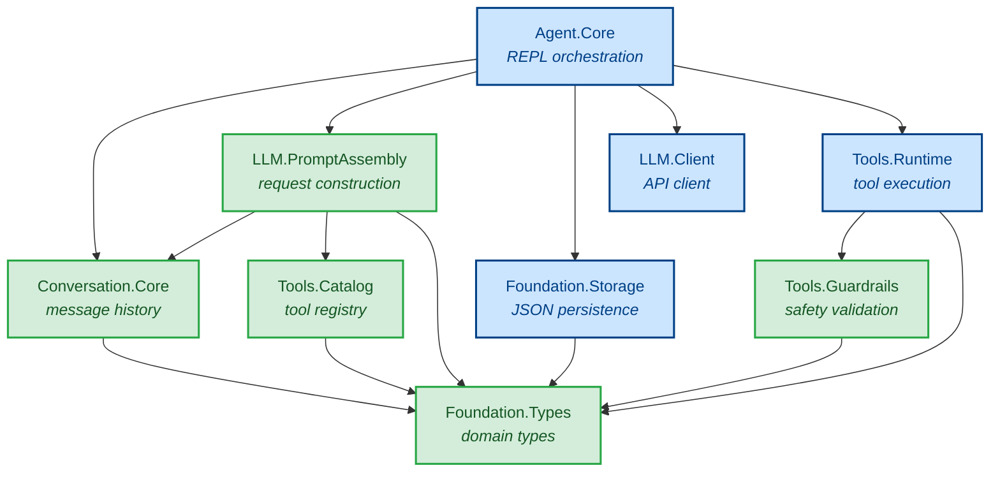

# Architecture Diagram

Module dependency graph for the Lumen agent, showing the relationship between pure and IO modules.

Green modules are **pure** (no IO) and are fully testable with property-based testing. Blue modules perform **IO** (filesystem, network, or terminal).

**Note:** The `PA → TC` (PromptAssembly → Tools.Catalog) edge is a known temporary coupling that will be removed in Phase 3 when `assembleRequest` is refactored to accept a `PromptRequest` value object.

## Module Responsibilities

| Module | Package | Layer | IO? | Responsibility |
|--------|---------|-------|-----|----------------|
| **Agent.Core** | `lumen-agent-core` | Orchestration | Yes (terminal) | REPL loop, tool execution loop, coordinates all other modules |
| **LLM.Client** | `lumen-llm-core` | IO Boundary | Yes (network) | HTTP requests to Anthropic API |
| **Foundation.Storage** | `lumen-runtime-foundation` | IO Boundary | Yes (filesystem) | Read/write conversation JSON files |
| **Tools.Runtime** | `lumen-tool-framework` | IO Boundary | Yes (filesystem/shell) | Execute validated tool calls |
| **LLM.PromptAssembly** | `lumen-llm-core` | Pure Core | No | Build API requests from state; inject tools |
| **Tools.Guardrails** | `lumen-tool-framework` | Pure Core | No | Classify and validate tool actions |
| **Tools.Catalog** | `lumen-tool-framework` | Pure Core | No | Enumerate all registered tools |
| **Conversation.Core** | `lumen-conversation-system` | Pure Core | No | Message list operations |
| **Foundation.Types** | `lumen-runtime-foundation` | Pure Core | No | Shared data type definitions |

## Key Observations

- **Agent.Core** is the only module that depends on everything else. No other module imports `Agent.Core`.
- **Foundation.Types** has no internal dependencies — it only re-exports from `anthropic-types` and `anthropic-protocol`.
- **LLM.Client** has no internal dependencies either — it depends only on the external `anthropic-client` library.
- The pure chain is: `PromptAssembly → Conversation.Core → Foundation.Types`.
- IO modules do not depend on each other — `Foundation.Storage`, `LLM.Client`, and `Tools.Runtime` are independent.
