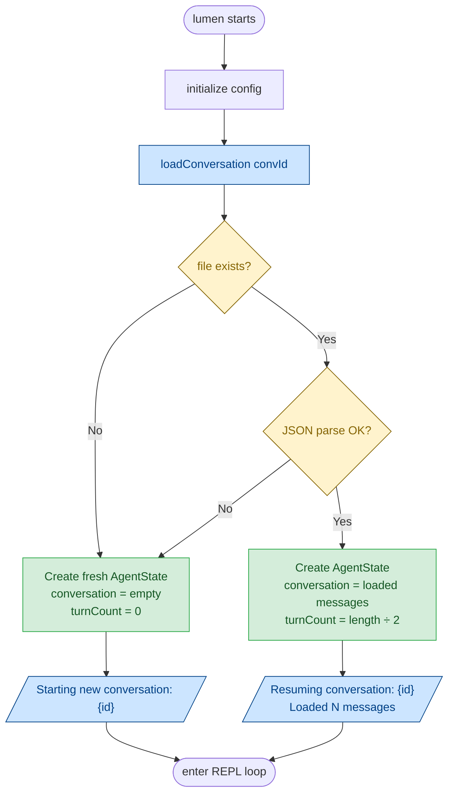
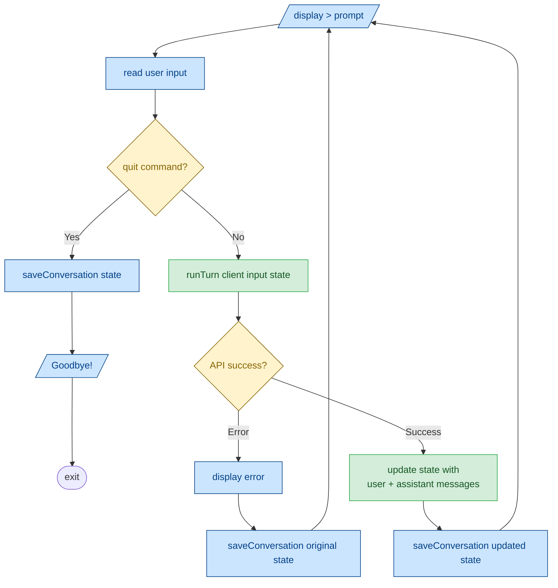
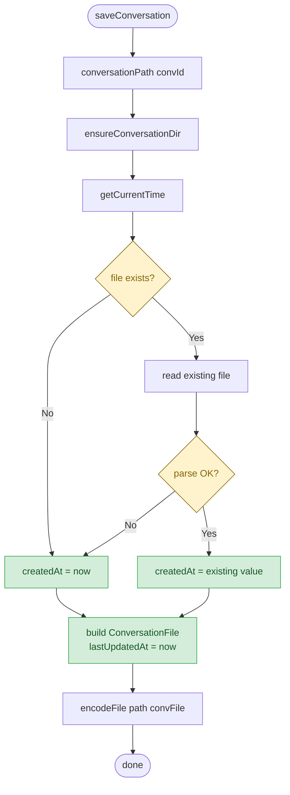

# Persistence Flow

Data flow diagram showing how conversations are loaded at startup, updated during the session, and saved to disk.

## Startup: Initialize

## Turn Cycle: Save After Each Turn

## Save Operation Detail

