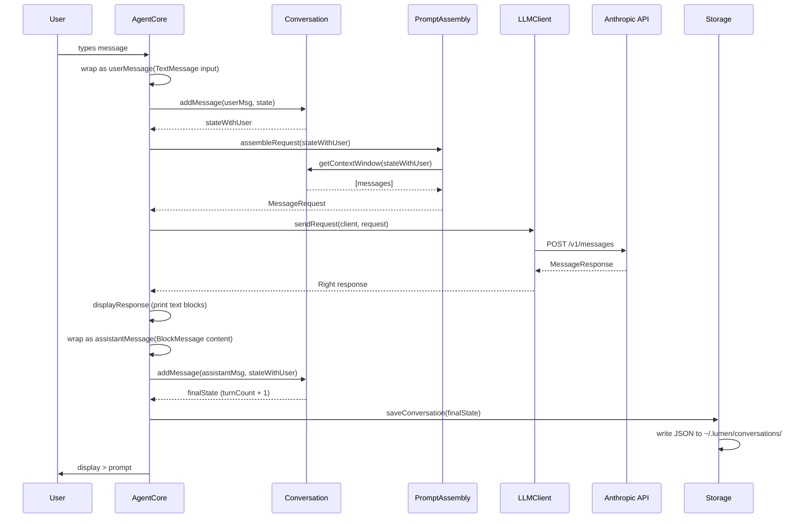
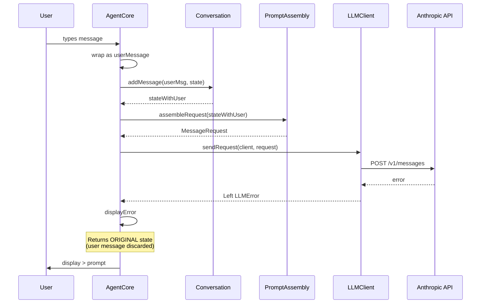

# Request Flow

Sequence diagram showing a single conversation turn — from user input to displayed response.

## Error Path

When the API returns an error, the flow is shorter:

The user's message is **not** saved to the conversation on error. This prevents orphaned messages without responses.
