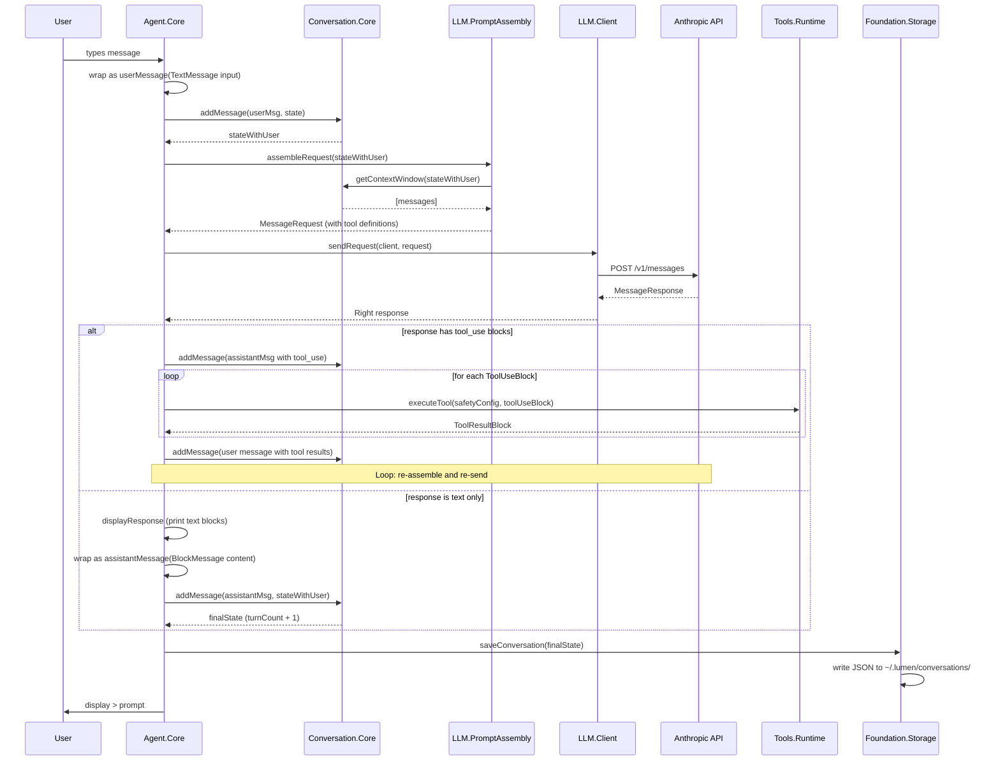
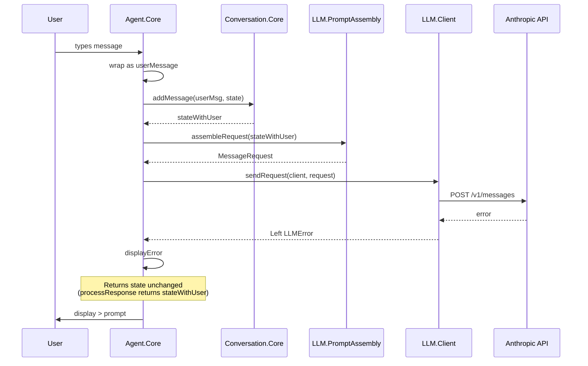

# Request Flow

Sequence diagram showing a single conversation turn — from user input to displayed response.

## Error Path

When the API returns an error, the flow is shorter:

On API error, `processResponse` returns the state as passed in (which includes the user message). The turn is not retried, and the orphaned user message is persisted on the next save.
