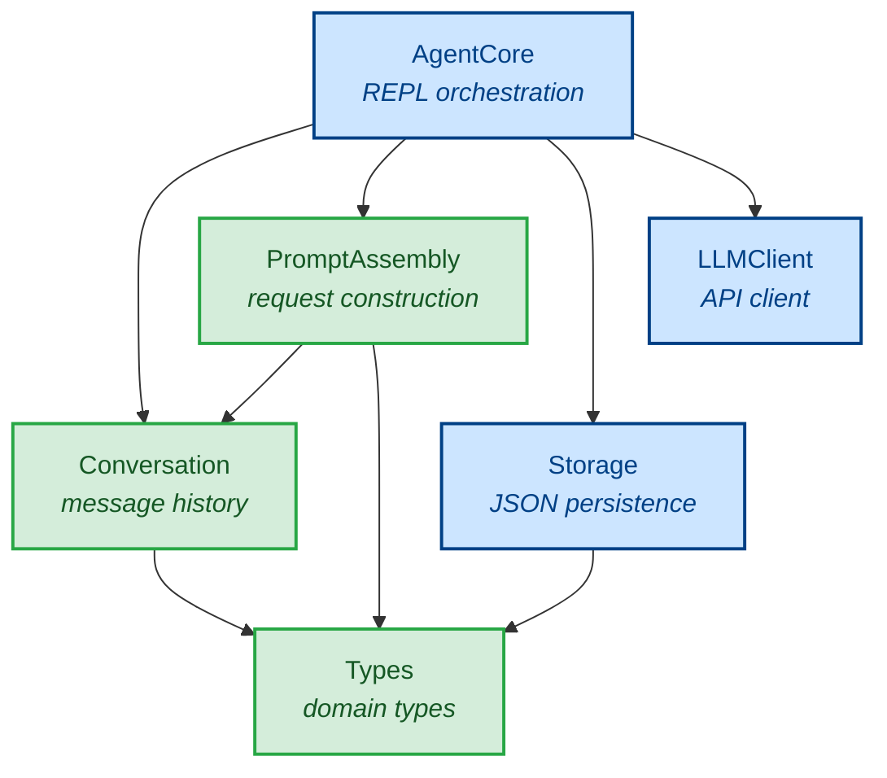

# Lumen Onboarding Guide

Welcome to the Lumen codebase. This guide gets you from "never seen this repo" to "ready to contribute" as fast as possible. It is written for Haskell-literate engineers who are new to the project.

---

## 1. What is Lumen

Lumen is an AI coding agent implemented in Haskell. It runs as a terminal REPL: you type a message, it calls the Anthropic API, displays the response, and persists the conversation to disk. The primary goal is **educational** — the project is a learning vehicle for implementing the full landscape of agentic patterns (memory, tool execution, planning, multi-agent coordination) through a real, working system.

The codebase uses a local ecosystem of Anthropic API libraries (`anthropic-types`, `anthropic-protocol`, `anthropic-client`) developed alongside the agent itself, rather than a published package.

---

## 2. Project Status

**Phase 1 (Walking Skeleton) is complete.** The agent can hold a multi-turn text conversation with Claude, persist that conversation to disk, and resume it on restart.

**Phase 2 (Tool Execution) is next.** The construction plan calls for adding `ToolCatalog`, `Guardrails`, and `ToolRuntime` modules, then wiring them into `AgentCore` so the LLM can read files, write files, list directories, execute shell commands, and search files.

For the full phase plan, see [The Roadmap](#10-the-roadmap) below and the design documents at `~/Projects/design/lumen/`.

---

## 3. Prerequisites

| Requirement | Version | Notes |
|---|---|---|
| GHC | 9.10.3+ | The project uses GHC2021 |
| Cabal | 3.10+ | Multi-package project via `cabal.project` |
| Anthropic API key | — | Set as `ANTHROPIC_API_KEY` in environment |
| Local Anthropic libraries | — | See [Local Dependencies](#11-local-dependencies) |

The local libraries must be checked out at the paths listed in `cabal.project`:

```
../../libs/anthropic-types
../../libs/anthropic-protocol
../../libs/anthropic-client
../../libs/json-schema-combinators
```

Relative to the project root at `~/Perso/software/apps/lumen`, these resolve to `~/Perso/software/libs/`.

---

## 4. Quick Start

```bash
# Build everything
cabal build all

# Set your API key
export ANTHROPIC_API_KEY=sk-ant-...

# Run the agent (default conversation ID "default")
cabal run lumen

# Run with explicit options
cabal run lumen -- --model claude-sonnet-4-20250514 --conversation-id my-session

# Have a conversation
> Hello, what can you do?
# Claude responds...
> Explain the purpose of PromptAssembly.hs
# Claude responds...
> quit
Goodbye!

# Run the test suite
cabal test

# Resume the same conversation later
cabal run lumen -- --conversation-id my-session
```

Conversations persist to `~/.lumen/conversations/<conversation-id>.json`. Quit commands: `quit`, `exit`, `q`, `:q`.

---

## 5. Project Layout

```
lumen/
├── cabal.project              # Multi-package build; lists local library paths
├── lumen.cabal                # Package definition: library, executable, test-suite
│
├── app/
│   └── Main.hs                # CLI entry point: arg parsing, env var reading, mainLoop invocation
│
├── src/
│   ├── Types.hs               # All shared types: AgentConfig, AgentState, ConversationFile, ValidationResult
│   ├── Conversation.hs        # Pure message list operations: addMessage, getRecent, getContextWindow
│   ├── Storage.hs             # IO: save/load conversation JSON to ~/.lumen/conversations/
│   ├── LLMClient.hs           # IO: thin wrapper over anthropic-client; createClient, sendRequest, LLMError
│   ├── PromptAssembly.hs      # Pure: builds MessageRequest from AgentState; assembleRequest, defaultSystemPrompt
│   └── AgentCore.hs           # IO: REPL orchestration; initialize, mainLoop, runTurn
│
├── test/
│   ├── Main.hs                # Tasty test runner; collects all property groups
│   └── Test/
│       ├── Generators.hs      # Hedgehog generators for all domain types
│       ├── Types.hs           # Properties for Types module (JSON round-trips, field access)
│       ├── Conversation.hs    # Properties for Conversation module (addMessage, getRecent, etc.)
│       ├── PromptAssembly.hs  # Properties for PromptAssembly (request construction)
│       ├── AgentCore.hs       # Properties for AgentCore (isQuitCommand, etc.)
│       └── Storage.hs         # Properties for Storage (path generation, file round-trips)
│
└── docs/
    ├── index.md               # Documentation index
    ├── onboarding/            # Onboarding: guide.md, getting-started.md
    ├── guides/                # Task-oriented: configuration, testing, contributing, adding-a-tool, extending-modules
    ├── explanation/           # Conceptual: architecture, testing-strategy, persistence
    ├── reference/             # API reference for every module
    └── diagrams/              # Mermaid diagrams: architecture, request-flow, persistence-flow
```

---

## 6. Architecture at a Glance

Lumen separates pure domain logic from IO effects. The six source modules fall into two groups:

| Module | IO? | Role |
|---|---|---|
| `Types` | Pure | Foundation — shared types used by all modules |
| `Conversation` | Pure | Message list operations |
| `PromptAssembly` | Pure | Builds the `MessageRequest` sent to the LLM |
| `Storage` | IO (filesystem) | Persists conversation history to JSON files |
| `LLMClient` | IO (network) | Calls the Anthropic API |
| `AgentCore` | IO (terminal + all) | REPL loop; orchestrates all other modules |

The dependency graph:



Key observations:
- `AgentCore` is the only module that imports everything else. Nothing imports `AgentCore`.
- `Types` and `LLMClient` have no internal imports — they depend only on external libraries.
- The pure chain is: `AgentCore → PromptAssembly → Conversation → Types`.
- `Storage` and `LLMClient` are independent of each other.

See [docs/diagrams/architecture.md](../diagrams/architecture.md) for the full annotated diagram.

---

## 7. Module-by-Module Walkthrough

### `src/Types.hs` — Shared Type Definitions

The foundation module. Defines all data types used across the agent; no other module defines domain types. All imports flow outward from here.

**Key types exported:**
- `AgentConfig` — static configuration: API key, model, maxTokens, systemPrompt, safetyConfig, conversationId
- `AgentState` — mutable runtime state: config, conversation history (`[Message]`), turnCount
- `SafetyConfig` — allowedPaths, blockedPaths, allowSystemPaths (used in Phase 2 by Guardrails)
- `ConversationFile` — the JSON persistence format: conversationId, createdAt, lastUpdatedAt, messages
- `ValidationResult` — `Allowed | Blocked Text` (used in Phase 2 by Guardrails)
- Re-exports from `anthropic-types`: `Message`, `MessageContent`, `ContentBlock`, `Role`, `SystemPrompt`, `StopReason`

**Phase notes:** `SafetyConfig` and `ValidationResult` are defined here but not used until Phase 2. They exist now so the types module is the single source of truth.

---

### `src/Conversation.hs` — Pure Message History

All pure functions. Manages the `[Message]` list stored in `AgentState`. No IO, no external calls.

**Key exports:**
```haskell
addMessage    :: Message -> AgentState -> AgentState
addMessages   :: [Message] -> AgentState -> AgentState
getRecent     :: Int -> AgentState -> [Message]
getContextWindow :: AgentState -> [Message]   -- currently returns all; truncation is future work
getAll        :: AgentState -> [Message]
messageCount  :: AgentState -> Int
isEmpty       :: AgentState -> Bool
```

**Connections:** Imported by `PromptAssembly` (to get the context window) and `AgentCore` (to add each turn's messages).

**Phase notes:** `getContextWindow` currently returns all messages. Phase 6 (Performance & Streaming) will add token-budget-based truncation.

---

### `src/Storage.hs` — JSON Persistence

IO module. Serializes `AgentState` to `~/.lumen/conversations/<id>.json` and deserializes it on startup. Uses `aeson`'s `encodeFile`/`eitherDecodeFileStrict`.

**Key exports:**
```haskell
saveConversation    :: AgentState -> IO ()
loadConversation    :: Text -> IO (Maybe ConversationFile)
conversationExists  :: Text -> IO Bool
conversationPath    :: Text -> IO FilePath      -- ~/.lumen/conversations/<id>.json
ensureConversationDir :: FilePath -> IO ()
```

**Connections:** Called by `AgentCore` — once in `initialize` (to load), and once per turn in `mainLoop` (to save). Imported `Types` for `ConversationFile` and `AgentState`.

**Phase notes:** Phase 3 (Persistence & Memory) upgrades Storage to a namespaced key-value interface.

---

### `src/LLMClient.hs` — API Wrapper

IO module. Thin wrapper over `anthropic-client`. Hides the library's `ClientError` type behind Lumen's own `LLMError` ADT, keeping library details out of `AgentCore`.

**Key exports:**
```haskell
createClient  :: Text -> IO ClientHandle      -- wraps AnthropicClient
sendRequest   :: ClientHandle -> MessageRequest -> IO (Either LLMError MessageResponse)

data LLMError
  = APIError !Text
  | NetworkError !Text
  | TimeoutError
  | ParseError !Text
  | UnknownError !Text
```

**Connections:** `Main.hs` calls `createClient`; `AgentCore.runTurn` calls `sendRequest`. No internal module imports.

**Phase notes:** Phase 6 (Performance & Streaming) will add streaming support via `Anthropic.Client.Streaming`, which the library already provides but this module does not yet use.

---

### `src/PromptAssembly.hs` — Request Construction

Pure module. Takes an `AgentState` and produces a `MessageRequest` ready to send to the API. Handles system prompt injection and context window selection.

**Key exports:**
```haskell
assembleRequest    :: AgentState -> MessageRequest
defaultSystemPrompt :: SystemPrompt
```

`assembleRequest` calls `getContextWindow` to get the message list, then uses `messageRequest` from `anthropic-protocol` to build the request, and injects either the configured system prompt or `defaultSystemPrompt`.

**Connections:** Imports `Conversation.getContextWindow` and `Types`. Called by `AgentCore.runTurn`.

**Phase notes:** Phase 2 (Tool Execution) adds tool definitions to the request. Phase 7 (Planning Mode) adds mode-specific prompt templates.

---

### `src/AgentCore.hs` — REPL Orchestration

IO module. The top-level orchestrator. Coordinates all other modules to implement the agent loop.

**Key exports:**
```haskell
initialize  :: AgentConfig -> IO AgentState      -- loads or creates conversation
mainLoop    :: ClientHandle -> AgentState -> IO ()  -- the REPL loop
runTurn     :: ClientHandle -> Text -> AgentState -> IO AgentState
isQuitCommand :: Text -> Bool
```

`mainLoop` is tail-recursive: read input → if quit, save and exit; else call `runTurn`, save, recurse. `runTurn` adds the user message, assembles the request, sends it, displays the response, adds the assistant message, increments `turnCount`.

**Connections:** Imports every other module. `Main.hs` calls `initialize` and `mainLoop`.

**Phase notes:** Phase 2 adds a tool execution loop inside `runTurn` to handle `ToolUse` blocks from the LLM response. Currently only `TextContent` blocks are extracted and printed.

---

### `app/Main.hs` — CLI Entry Point

The executable. Parses `--api-key`, `--model`, `--conversation-id` flags; falls back to `ANTHROPIC_API_KEY` environment variable; builds `AgentConfig`; calls `LLMClient.createClient` and `AgentCore.initialize`/`mainLoop`.

Default values:
- Model: `claude-sonnet-4-20250514`
- Max tokens: `4096`
- Conversation ID: `"default"`

Wraps `mainLoop` in a `catch` for fatal exceptions. Prints a welcome banner on startup.

---

## 8. Data Flow: Anatomy of a Turn

When you type a message and press Enter, here is what happens:

1. **`AgentCore.mainLoop`** reads the line from stdin (`TIO.getLine`).
2. **`AgentCore.isQuitCommand`** checks if you typed `quit`/`exit`/`q`/`:q`. If so, saves and exits.
3. **`AgentCore.runTurn`** is called with the input text.
4. The input is wrapped as a `userMessage (TextMessage input)` using `anthropic-protocol`.
5. **`Conversation.addMessage`** appends the user message to `AgentState.conversation`, returning `stateWithUser`.
6. **`PromptAssembly.assembleRequest`** is called on `stateWithUser`.
   - It calls `Conversation.getContextWindow` to get all messages.
   - It calls `messageRequest` to build a `MessageRequest`, then injects the system prompt.
7. **`LLMClient.sendRequest`** sends the `MessageRequest` to `POST /v1/messages`.
8. On success: the response `content` is extracted, text blocks are printed to stdout.
9. The response is wrapped as an `assistantMessage (BlockMessage content)`.
10. **`Conversation.addMessage`** appends the assistant message, and `turnCount` is incremented.
11. **`Storage.saveConversation`** writes the updated state to `~/.lumen/conversations/<id>.json`.
12. `mainLoop` recurses with the new state.

On API error, `displayError` prints the error and the function returns the **original** state (before the user message was added). The failed turn is discarded.

See the full sequence diagram at [docs/diagrams/request-flow.md](../diagrams/request-flow.md).

---

## 9. Key Design Decisions

**Pure core / IO shell.** Pure modules (`Types`, `Conversation`, `PromptAssembly`) contain no IO and can be tested with property-based tests that run thousands of iterations cheaply. IO modules (`Storage`, `LLMClient`, `AgentCore`) are thin — they delegate logic to pure helpers. This makes the domain testable without mocking.

**Hedgehog for testing.** The test suite uses property-based testing exclusively. Properties express invariants (e.g., "adding a message always increases length by 1"; "getRecent n returns at most n messages") that hold for any well-formed input, not just the cases the author thought of. Generators live in `test/Test/Generators.hs` and are shared across all test modules.

**JSON persistence.** Conversations are stored as plain JSON files, one per conversation ID. The format (`ConversationFile`) includes `createdAt`/`lastUpdatedAt` timestamps and the full message list. This is intentionally simple — Phase 3 (Persistence & Memory) will upgrade to a namespaced key-value interface, but the JSON format keeps Phase 1 observable and debuggable.

**No streaming.** All API calls are blocking. The `anthropic-client` library supports streaming, but the MVP uses the blocking `createMessage` call. This simplifies the REPL loop considerably — no `async`, no `STM`, no backpressure handling. Phase 6 (Performance & Streaming) adds streaming.

**`AgentConfig` is immutable.** Configuration is read once at startup and threaded through `AgentState.config`. There is no mutable global config. Runtime state changes (new messages, turn count) live in `AgentState`; config never mutates.

---

## 10. The Roadmap

The project implements a full 19-module architecture incrementally. Each phase adds new modules or enhances existing ones. (The design docs at `~/Projects/design/lumen/roadmap.md` use 0-indexed phase numbers; here we use 1-indexed to match the source code and runtime output.)

| Phase | Name | Status | What it adds |
|---|---|---|---|
| 1 | MVP (Walking Skeleton) | **Complete** | Text REPL, LLMClient, Storage, Conversation, PromptAssembly, AgentCore |
| 2 | Tool Execution | Not started | ToolCatalog, Guardrails, ToolRuntime, tool dispatch in AgentCore |
| 3 | Persistence & Memory | Not started | Memory module, Session Management, upgraded Storage (namespaced key-value) |
| 4 | Robust Infrastructure | Not started | Telemetry, Error Recovery, Configuration Management, enhanced Guardrails |
| 5 | Code Intelligence | Not started | Code Intelligence, Diff Management, Validation, code-aware tools |
| 6 | Performance & Streaming | Not started | Caching, Stream Processing, streaming LLM output |
| 7 | Planning Mode | Not started | Planning module, planning workflow in AgentCore, planning prompt templates |
| 8 | External Integrations | Not started | External Integration Hub, LSP servers, Git integration, build systems |
| 9 | Multi-Agent | Not started | Multi-Agent module, sub-agent spawning, delegation, result aggregation |

The recommended order is sequential (1 → 2 → ... → 9), but phases 3+ can be reordered based on pain points (e.g., jump to Phase 6 if streaming matters more than memory).

Full details: `~/Projects/design/lumen/roadmap.md`

---

## 11. Local Dependencies

Lumen depends on a local ecosystem of Anthropic API libraries, not published to Hackage. These are developed in the same repository ecosystem and referenced via relative paths in `cabal.project`.

| Library | Path (relative to project root) | Purpose |
|---|---|---|
| `anthropic-types` | `../../libs/anthropic-types` | Core types: `Message`, `ContentBlock`, `Role`, `StopReason`, `ApiKey`, `ApiError` |
| `anthropic-protocol` | `../../libs/anthropic-protocol` | Request/response types: `MessageRequest`, `MessageResponse`, `messageRequest`, `userMessage`, `assistantMessage`; JSON schema support for tool definitions |
| `anthropic-client` | `../../libs/anthropic-client` | Full client SDK: `AnthropicClient`, `newClient`, `defaultConfig`, `createMessage`; handles HTTP, retry logic, rate limits |
| `json-schema-combinators` | `../../libs/json-schema-combinators` | Schema combinators used by `anthropic-protocol` for tool `input_schema` definitions |

A fifth library, `anthropic-tools-common`, is referenced in the technical design for Phase 2. It provides pre-built tool definitions (`read_file`, `write_file`, `list_directory`, `execute_command`, `search_files`) with typed input records and executors. It will be added to `cabal.project` when Phase 2 begins.

**Division of responsibility:**
- API boundary types (Message, request/response structs) come from `anthropic-types` and `anthropic-protocol`.
- The HTTP client, retries, and connection management come from `anthropic-client`.
- Lumen defines its own types (`AgentConfig`, `AgentState`, `ConversationFile`) for domain and persistence concerns.

---

## 12. How to Contribute

Read the full guide at [docs/guides/contributing.md](../guides/contributing.md). The short version:

**Pure/IO convention:** Keep IO out of `Types`, `Conversation`, and `PromptAssembly`. If your feature has both pure logic and IO, split them into separate modules. `AgentCore` is the only module that should orchestrate IO across modules.

**Testing approach:** Write Hedgehog property tests, not example-based unit tests. Add generators for new types in `test/Test/Generators.hs`. Properties should express invariants, not just "output equals expected value." Run with `cabal test` (100 iterations default) or `make test-full` (10,000 iterations).

**Adding a new module:**
1. Define types in `src/Types.hs` (if shared) or in the new module (if local).
2. Create `src/MyModule.hs` as a pure module if possible.
3. Add it to `exposed-modules` in `lumen.cabal`.
4. Add generators to `test/Test/Generators.hs`.
5. Create `test/Test/MyModule.hs` with properties.
6. Add the test module to `other-modules` in `lumen.cabal` and import it in `test/Main.hs`.

**PR checklist:**
1. `cabal build all` — no warnings
2. `cabal test` — all properties pass
3. New types have generators
4. New logic has properties
5. Exported functions have Haddock comments
6. Documentation updated if behaviour changes

---

## 13. Where to Find Things

| I want to... | Go to |
|---|---|
| Understand the full planned architecture | `~/Projects/design/lumen/design/architecture.md` |
| Understand the incremental development approach | `~/Projects/design/lumen/incremental-approach.md` |
| See what's planned for Phase 2 (tool execution) | `~/Projects/design/lumen/implementation/construction-plan.md` |
| Read the 7-phase roadmap | `~/Projects/design/lumen/roadmap.md` |
| Find where a type is defined | `src/Types.hs` |
| Find message list operations | `src/Conversation.hs` |
| Find the API request builder | `src/PromptAssembly.hs` |
| Find the persistence code | `src/Storage.hs` |
| Find the HTTP client wrapper | `src/LLMClient.hs` |
| Find the REPL loop | `src/AgentCore.hs` |
| Run the agent | `cabal run lumen` |
| Run tests | `cabal test` |
| Configure the agent | [docs/guides/configuration.md](../guides/configuration.md) |
| Understand the pure/IO split in depth | [docs/explanation/architecture.md](../explanation/architecture.md) |
| See the module dependency diagram | [docs/diagrams/architecture.md](../diagrams/architecture.md) |
| See the per-turn data flow diagram | [docs/diagrams/request-flow.md](../diagrams/request-flow.md) |
| Understand why Hedgehog | [docs/explanation/testing-strategy.md](../explanation/testing-strategy.md) |
| Understand the JSON storage format | [docs/explanation/persistence.md](../explanation/persistence.md) |
| Look up a specific function | [docs/reference/](../reference/) |

---

## 14. Further Reading

- **[Architecture explanation](../explanation/architecture.md)** — Deep dive on the pure core / IO shell pattern, module roles, and why the boundaries are drawn where they are.
- **[Testing strategy explanation](../explanation/testing-strategy.md)** — Why property-based testing, how Hedgehog works, test categories and priority levels.
- **[Persistence explanation](../explanation/persistence.md)** — The `ConversationFile` JSON format, startup/save/resume lifecycle, file layout.
- **[Module reference pages](../reference/)** — Signatures and descriptions for every exported function.
- **Design documents** — The full architecture, technical design, and construction plans live outside the repo at `~/Projects/design/lumen/`.
